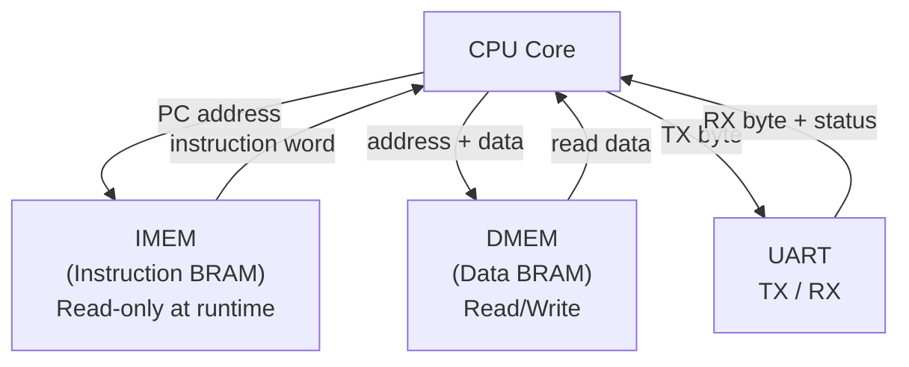
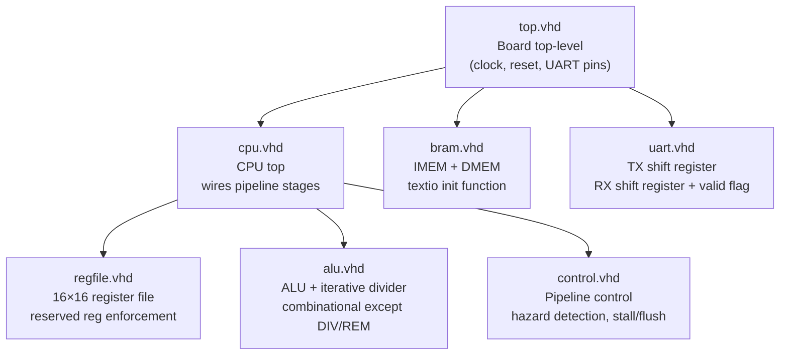

# CPU Architecture Specification

## Overview

A 16-bit, Harvard-architecture, pipelined CPU targeting Lattice FPGAs using the open-source toolchain (Yosys + nextpnr). Designed to run small but meaningful programs — including things like outputting a Fibonacci sequence over UART.

- **Word width:** 16-bit
- **Registers:** 16 × 16-bit
- **Instruction width:** 16-bit fixed
- **Architecture:** Harvard (separate instruction and data memory)
- **Pipeline:** 4-stage
- **Memory:** BRAM, initialized at synthesis time via VHDL impure function
- **Target toolchain:** Yosys + nextpnr (Lattice)

---

## Instruction Encoding

All instructions are exactly 16 bits wide. The top nibble always carries the opcode. The remaining 12 bits carry register indices or an immediate value depending on the instruction type.

### Register-type instructions

```
[15:12]  opcode  (4 bits)
[11:8]   Ra      (4 bits) — first source register
[7:4]    Rb      (4 bits) — second source register
[3:0]    Rd      (4 bits) — destination register
```

### LDI (load immediate low byte)

```
[15:12]  opcode  (4 bits)  — 0x2
[11:8]   Rd      (4 bits)  — destination register
[7:0]    imm8    (8 bits)  — unsigned immediate, loaded into Rd[7:0]; Rd[15:8] cleared
```

### LDIH (load immediate high byte)

```
[15:12]  opcode  (4 bits)  — 0x3
[11:8]   Rd      (4 bits)  — destination register
[7:0]    imm8    (8 bits)  — unsigned immediate, loaded into Rd[15:8]; Rd[7:0] unchanged
```

To load a full 16-bit constant, use LDI followed by LDIH:

```
LDI  R7, 0xCD       ; R7 = 0x00CD
LDIH R7, 0xAB       ; R7 = 0xABCD
```

### CMP (compare)

```
[15:12]  opcode  (4 bits)  — 0xA
[11:8]   Ra      (4 bits)  — first operand
[7:4]    Rb      (4 bits)  — second operand
[3:0]    mode    (4 bits)  — 0x0 = equality, 0x1 = greater-than (rest reserved)
```

Result always written to R5 (RCMP). 0 = true, 1 = false.

### JIZ (jump if zero)

```
[15:12]  opcode  (4 bits)  — 0xB
[11:8]   Ra      (4 bits)  — register holding jump target address
[7:4]    Rb      (4 bits)  — condition register; jump taken if Rb == 0
[3:0]    ----    (4 bits)  — unused
```

Unconditional jump: `JIZ Ra, R0` — always taken since R0 is always 0.

### URX (UART receive)

```
[15:12]  opcode  (4 bits)  — 0xE
[11:8]   ----    (4 bits)  — unused
[7:4]    ----    (4 bits)  — unused
[3:0]    Rd      (4 bits)  — destination register
```

### UTX / HLT and other single-register or no-register instructions

Unused fields are don't-care and should be written as zero by assemblers.

---

## Opcode Table

| Opcode | Mnemonic | Operands | Operation |
|--------|----------|----------|-----------|
| `0x0` | `AND` | `Ra, Rb, Rd` | `Rd ← Ra & Rb` |
| `0x1` | `HLT` | — | Halt pipeline |
| `0x2` | `LDI` | `Rd, imm8` | `Rd ← 0x00 \|\| imm8` |
| `0x3` | `LDIH` | `Rd, imm8` | `Rd[15:8] ← imm8`, `Rd[7:0]` unchanged |
| `0x4` | `LDM` | `Ra, Rd` | `Rd ← DMEM[Ra]` |
| `0x5` | `STM` | `Ra, Rb` | `DMEM[Ra] ← Rb` |
| `0x6` | `ADD` | `Ra, Rb, Rd` | `Rd ← Ra + Rb`, `REXT ← carry` |
| `0x7` | `SUB` | `Ra, Rb, Rd` | `Rd ← Ra - Rb`, `REXT ← borrow` |
| `0x8` | `MUL` | `Ra, Rb, Rd` | `Rd ← (Ra × Rb)[15:0]`, `REXT ← (Ra × Rb)[31:16]` |
| `0x9` | `DIV` | `Ra, Rb, Rd` | `Rd ← Ra ÷ Rb` (16 cycles) |
| `0xA` | `CMP` | `Ra, Rb, mode` | `RCMP ← compare result` (0 = true, 1 = false) |
| `0xB` | `JIZ` | `Ra, Rb` | `if Rb == 0: PC ← Ra` |
| `0xC` | `REM` | `Ra, Rb, Rd` | `Rd ← Ra mod Rb` (16 cycles) |
| `0xD` | `UTX` | `Ra` | Transmit `Ra[7:0]` over UART |
| `0xE` | `URX` | `Rd` | `Rd ← UART RX buffer` (non-blocking) |
| `0xF` | *reserved* | — | Treated as HLT |

### NOP

`NOP` is not a dedicated opcode. The canonical NOP is the all-zeros word:

```
0x0000  =  AND R0, R0 → R0
```

This is safe because R0 is hardwired to zero and writes to it are discarded. Any assembler should emit `0x0000` for a NOP directive.

### Notes on specific instructions

- **LDI** clears the high byte of Rd. **LDIH** leaves the low byte of Rd untouched. Use them in sequence to build a full 16-bit constant.
- **ADD / SUB** — REXT receives `0x0001` if carry/borrow occurred, `0x0000` otherwise. REXT holds this value until the next MUL, ADD, or SUB overwrites it.
- **MUL** — internally computes a 32-bit product. Low 16 bits go to Rd, high 16 bits go to REXT. REXT holds this value until the next MUL, ADD, or SUB overwrites it.
- **DIV / REM** — iterative shift-and-subtract divider, completes in exactly 16 cycles. If Rb is zero, the result is not written to Rd; instead `0x0001` is written to R1 (ERR).
- **CMP mode 0x0** — equality. RCMP = 0 if Ra == Rb, 1 otherwise.
- **CMP mode 0x1** — greater-than. RCMP = 0 if Ra > Rb, 1 otherwise.
- **CMP modes 0x2–0xF** — reserved. Behaviour undefined.
- **JIZ** — condition is Rb == 0. Use `JIZ Ra, R0` for an unconditional jump. Use `JIZ Ra, RCMP` to branch on a compare result.
- **UTX** — fire-and-forget. The programmer is responsible for polling R2 (USTAT) to confirm the transmitter is idle before sending. The hardware does not stall on UTX.
- **URX** — non-blocking. The programmer must poll R2 (USTAT) to confirm RX_RDY before calling URX. If called when no byte is ready, the result is undefined.
- **0xF (reserved)** — treated as HLT. Ensures uninitialized program memory words containing 0xFFFF do not cause runaway execution.

---

## Register File

16 registers, each 16 bits wide. Registers R0–R6 are reserved with hardware-enforced behaviour. Programmer writes to reserved registers are silently discarded.

| Reg | Name | Program-writable | Description |
|-----|------|-----------------|-------------|
| R0 | `ZERO` | No | Hardwired 0. Reads always return `0x0000`. Writes are ignored. |
| R1 | `ERR` | No | Hardware error codes. Written by CPU on fault conditions. |
| R2 | `USTAT` | No | UART status register. Updated by UART hardware every cycle. |
| R3 | `PC` | No | Program counter. Readable as a source operand. Written by control unit only. |
| R4 | `PSTART` | No | Program start address. Hardwired to `0x0000`. |
| R5 | `RCMP` | No | Compare result. Written by CMP. 0 = true, 1 = false. |
| R6 | `REXT` | No | ALU overflow/extension. Written by MUL, ADD, SUB. Holds last written value until next write. |
| R7–R15 | — | Yes | General-purpose registers (9 total). |

### Error Codes (R1)

| Value | Meaning |
|-------|---------|
| `0x0000` | No error |
| `0x0001` | Division by zero |
| `0x0002` | Reserved (UART fault, future use) |
| `0x0003` | Reserved (hardware fault, future use) |

### USTAT Bit Layout (R2)

```
[15:3]  Reserved — always 0
[2]     RX_OVR  — a byte arrived before the previous one was read (overrun)
[1]     RX_RDY  — a byte is in the RX buffer and ready to be read with URX
[0]     TX_BSY  — the UART transmitter is currently shifting out a byte
```

### REXT Semantics (R6)

| Instruction | What REXT receives |
|-------------|-------------------|
| `MUL Ra, Rb, Rd` | `(Ra × Rb)[31:16]` — high word of full 32-bit product |
| `ADD Ra, Rb, Rd` | `0x0001` if carry out occurred, `0x0000` otherwise |
| `SUB Ra, Rb, Rd` | `0x0001` if borrow occurred, `0x0000` otherwise |
| All others | REXT is not touched — holds whatever the last MUL/ADD/SUB wrote |

---

## Pipeline

The CPU uses a 4-stage in-order pipeline. All four stages execute simultaneously on different instructions.


### Stage Descriptions

| Stage | Work Done |
|-------|-----------|
| **IF** | Drive PC onto IMEM address bus, latch instruction word, increment PC |
| **ID** | Crack opcode nibble, read Ra and Rb from register file, detect hazards |
| **EX** | ALU operation, memory read/write, UART TX/RX, iterative divide |
| **WB** | Write result to Rd in register file, update hardware registers (RCMP, REXT, ERR, USTAT) |

### Pipeline Registers

```
IF/ID:  instruction[15:0],  pc_plus_one[15:0]
ID/EX:  opcode[3:0],  ra_val[15:0],  rb_val[15:0],  rd_idx[3:0],  pc_plus_one[15:0],  valid
EX/WB:  result[15:0],  rext[15:0],  wr_rext,  rd_idx[3:0],  valid
```

---

## Hazard Handling

### Data Hazards (RAW — Read After Write)

Detected in the ID stage by comparing the incoming Ra and Rb register indices against the Rd index in the ID/EX and EX/WB pipeline registers.

```
raw_hazard = ((Ra == ID_EX.Rd) OR (Rb == ID_EX.Rd)) AND ID_EX.valid
           OR ((Ra == EX_WB.Rd) OR (Rb == EX_WB.Rd)) AND EX_WB.valid
```

R0 is exempt — reads always return 0 so stalling on it wastes cycles for no reason. Reserved registers R5 (RCMP) and R6 (REXT) must be tracked — if an instruction reads RCMP immediately after CMP, or reads REXT immediately after MUL/ADD/SUB, the hazard detector must catch it and stall.

On a detected RAW hazard, IF and ID stall (pipeline registers hold state), and a bubble (`valid = 0`) is inserted into EX.

### Structural Hazards (DIV/REM)

The iterative divider takes exactly 16 cycles in EX. While it runs, `ex_busy` is asserted. IF and ID freeze for the duration. EX/WB receives bubbles for the 15 stall cycles.

### Control Hazards (Jumps)

JIZ flushes if Rb == 0 (jump taken). On a flush, the instructions currently in IF and ID have their `valid` bits cleared — they become bubbles and produce no side effects. Two instructions are always wasted on a taken jump.

### Control Signal Summary

```
ex_busy    ← divider is running
raw_hazard ← RAW detected in ID (R0 exempt)
jump_taken ← JIZ in EX with Rb == 0

stall_if   ← ex_busy OR raw_hazard
stall_id   ← ex_busy OR raw_hazard
flush_if   ← jump_taken
flush_id   ← jump_taken
```

---

## Memory Architecture

Harvard architecture — instruction memory and data memory are completely separate BRAMs with no shared address space.



### IMEM

- Read-only at runtime (Harvard — no self-modifying code)
- Initialized at synthesis time via a VHDL impure function using `std.textio`
- Init file format: one 16-bit hex word per line
- File path provided as a VHDL generic so programs can be swapped without changing HDL

### DMEM

- Read/write, word-addressed
- Size controlled by a VHDL generic (number of words, power of two recommended)
- Uninitialized at reset unless explicitly set

### Address Space

All addresses are **word addresses** — each address points to a 16-bit word, not a byte. The address space size is determined by the DMEM size generic.

---

## UART

Separate TX and RX paths. Baud rate divisor computed from a system clock frequency generic at synthesis time.

- **UTX** — programmer loads a byte into a GP register and issues UTX. The byte is latched from `Ra[7:0]` and shifted out. `R2[0] (TX_BSY)` is set while transmitting. The programmer must poll before sending again.
- **URX** — programmer polls `R2[1] (RX_RDY)` first. When set, URX reads the byte out of the RX buffer into `Rd` and clears `RX_RDY`. If a second byte arrives before the first is read, `R2[2] (RX_OVR)` is set.

---

## Module Hierarchy



---

## VHDL Implementation Notes

### BRAM Initialization

An impure function in `bram.vhd` reads the hex init file at elaboration time using `std.textio`. The function is called in the BRAM signal declaration. Yosys handles this correctly. Example skeleton:

```vhdl
impure function init_mem(filename : string) return mem_t is
    file f        : text open read_mode is filename;
    variable ln   : line;
    variable word : std_logic_vector(15 downto 0);
    variable mem  : mem_t := (others => (others => '0'));
begin
    for i in mem_t'range loop
        exit when endfile(f);
        readline(f, ln);
        hread(ln, word);
        mem(i) := word;
    end loop;
    return mem;
end function;

signal imem : mem_t := init_mem("program.hex");
```

### Reserved Register Enforcement

In `regfile.vhd`, the write port is gated. Programmer instructions may not write to R0–R6:

```vhdl
if wr_en = '1' and rd_idx >= 7 then
    regs(to_integer(rd_idx)) <= wr_data;
end if;
```

R1 (ERR), R5 (RCMP), and R6 (REXT) have separate write paths from hardware (ALU signals, CMP result, USTAT logic) that bypass this gate.

### Iterative Divider

DIV and REM share a shift-and-subtract divider instantiated inside the ALU. It takes a `start` pulse, runs for 16 cycles, and raises `done`. The control unit asserts `ex_busy` from `start` until `done`. The quotient and remainder are both available when `done` is raised; the opcode selects which one goes to Rd.

---

## Programming Model

### Loading a 16-bit Constant

```
LDI  R7, 0xCD       ; R7 = 0x00CD
LDIH R7, 0xAB       ; R7 = 0xABCD
```

### Unconditional Jump

```
LDI  R7, 0x00
LDIH R7, 0x00       ; load target address into R7
JIZ  R7, R0         ; R0 is always 0 — jump always taken
```

### Conditional Branch (jump if equal)

```
CMP  Ra, Rb, 0x0    ; RCMP = 0 if Ra == Rb
JIZ  target, RCMP   ; jump if equal (RCMP == 0)
```

### Conditional Branch (jump if NOT equal)

There is no JNZ instruction. Use a skip pattern instead:

```
CMP  Ra, Rb, 0x0    ; RCMP = 0 if Ra == Rb
JIZ  skip, RCMP     ; if equal, skip the unconditional jump
JIZ  target, R0     ; not equal — jump to target
skip:
```

### UART Transmit Pattern

```
; Assumes TX_BSY mask 0x01 is preloaded in R8
poll_tx:
    AND  R9, R2, R8     ; R9 = USTAT & TX_BSY
    JIZ  send, R9       ; if TX_BSY == 0, transmitter is free
    JIZ  poll_tx, R0    ; else loop
send:
    UTX  R7
```

### UART Receive Pattern

```
; Assumes RX_RDY mask 0x02 is preloaded in R8
poll_rx:
    AND  R9, R2, R8     ; R9 = USTAT & RX_RDY
    JIZ  poll_rx, R9    ; if RX_RDY == 0, not ready — loop
    URX  R7             ; read byte into R7
```

### Multi-word Multiply

```
MUL  R7, R8, R9     ; R9  = low 16 bits of product
                    ; R6 (REXT) = high 16 bits of product
```

---

## Constraints and Known Limitations

- No stack. There is no CALL or RET instruction. Subroutine return addresses must be managed manually in GP registers.
- No interrupts. All I/O is polled.
- LDI is limited to 8-bit immediates. Use LDI + LDIH to build a full 16-bit constant.
- MUL upper 16 bits are in REXT. REXT is overwritten by the next MUL, ADD, or SUB.
- SUB wraps on underflow. Borrow is captured in REXT.
- Two instructions are always flushed on a taken jump.
- URX result is undefined if called when RX_RDY is not set.
- CMP modes 0x2–0xF are undefined. Assemblers should reject them.
- Opcode 0xF is reserved and treated as HLT.
